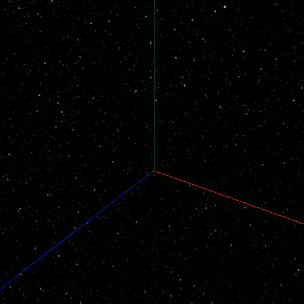
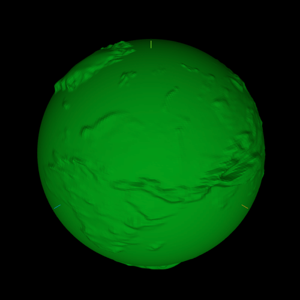
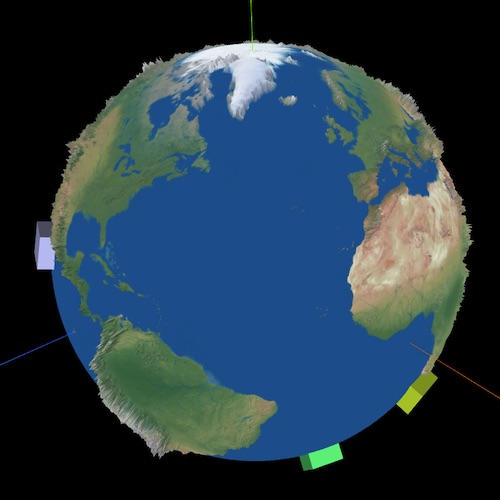
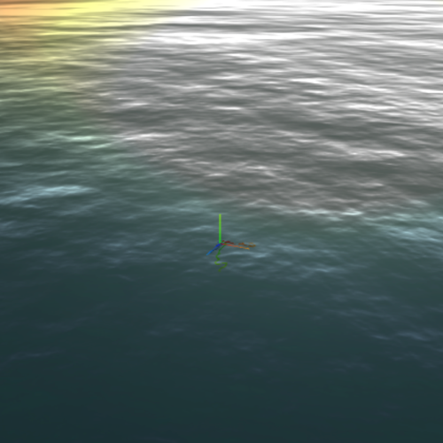

Planet WebGL Engine
===

# Goal
A lightweight WebGL world render engine that works great with ThreeJs.

# Roadmap
- [x] Camera controls
- [ ] Level of detail => Tiled terrain and maps
- [ ] Terrain sampling
- [ ] Physics example

# Examples

&nbsp;
&nbsp;
&nbsp;
&nbsp;
&nbsp;
&nbsp;

# Inspiration
- WebGL Earth experiment https://blog.mastermaps.com/2013/09/creating-webgl-earth-with-threejs.html
    - Github https://github.com/turban/webgl-earth#readme
- Cesium https://github.com/CesiumGS/cesium
- Cartographic https://developpaper.com/three-js-to-realize-the-simulation-migration-of-globe-earth-city/
- threex.planets.js https://github.com/jeromeetienne/threex.planets
- terrain shader http://www.smartjava.org/examples/heightmap/